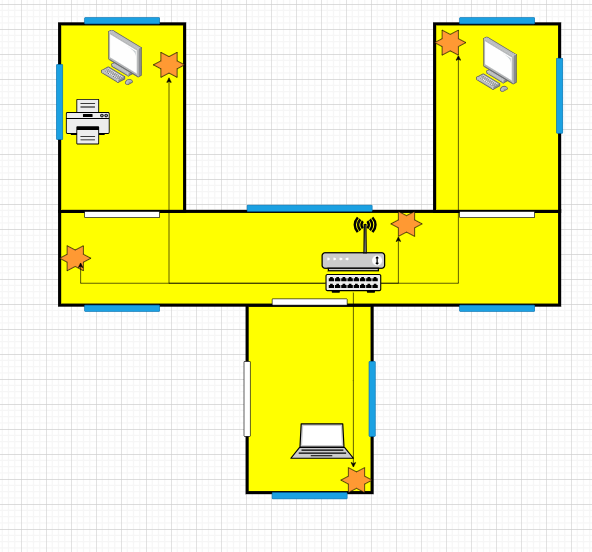
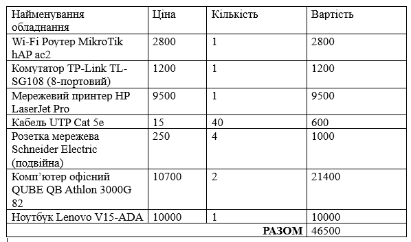

# Звіт до лабораторної роботи №2
## Тема: Проєктування локальної мережі офісу

**Виконав:** Литвиненко Сергій Анатолійович
**Варіант:** 16

---

### Опис проєкту
Було спроєктовано локальну мережу для малого офісу. 
- **Топологія:** "Зірка". Всі пристрої підключаються до центрального комутатора.
- **Мережеві рішення:** - Використано гігабітний комутатор для швидкої передачі важких графічних файлів.
  - Встановлено Wi-Fi роутер для гостьового доступу та мобільних пристроїв.
  - Кожна робоча зона обладнана подвійними розетками для ПК та IP-телефону.

---

### Ілюстрації проєкту

*Рис 1. Схема приміщення*

*Рис 2. Таблиця*
---

### Розрахунок вартості обладнання (Таблиця 9)
| Найменування обладнання | Ціна | Кількість | Вартість |
| :--- | :--- | :--- | :--- |
| Wi-Fi Роутер MikroTik hAP ac2 | 2800 | 1 | 2800 |
| Комутатор TP-Link TL-SG108 (8-портовий) | 1200 | 1 | 1200 |
| Мережевий принтер HP LaserJet Pro | 9500 | 1 | 9500 |
| Кабель UTP Cat 5e | 15 | 40 | 600 |
| Розетка мережева Schneider Electric (подвійна) | 250 | 4 | 1000 |
| Комп’ютер офісний QUBE QB Athlon 3000G 82 | 10700 | 2 | 21400 |
| Ноутбук Lenovo V15-ADA | 10000 | 1 | 10000 |
| **РАЗОМ** | | | **46500** |

---

### Висновок
Під час виконання роботи було підібрано комплект обладнання, що забезпечує потреби сучасного офісу. Загальна вартість проєкту склала 46 500 грн.
